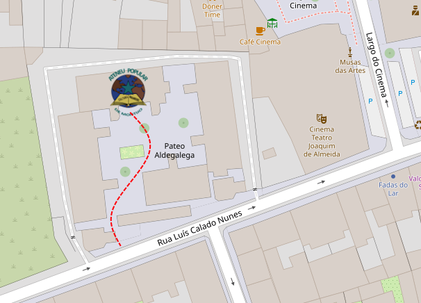

Estás à procura de uma noite divertida e cheia de desafios? Então, não podes perder a nossa Noite de Jogos de Tabuleiro! 🏆

No grupo de jogos de tabuleiro do Montijo, a diversão é garantida com uma vasta seleção de jogos para todos os gostos. Seja para competir, aprender ou simplesmente conhecer novas pessoas, esta noite promete ser inesquecível! ✨

Não sabes jogar? Não te preocupes! Temos uma comunidade acolhedora e experiente pronta para te ensinar tudo o que precisas saber. E se tens um jogo em casa que ainda não experimentaste, traz a caixa e junta-te a nós! Esta é a oportunidade perfeita para descobrir novos favoritos e partilhar a tua paixão pelos jogos de tabuleiro.

🗓 **Quando:** 14 de Março

📍 **Onde:** Ateneu Popular do Montijo

⏰ **Hora:** A partir das 21:30

Marca na tua agenda e vem jogar connosco! Esta é a oportunidade perfeita para fazer novos amigos e viver momentos únicos em boa companhia. 🔥